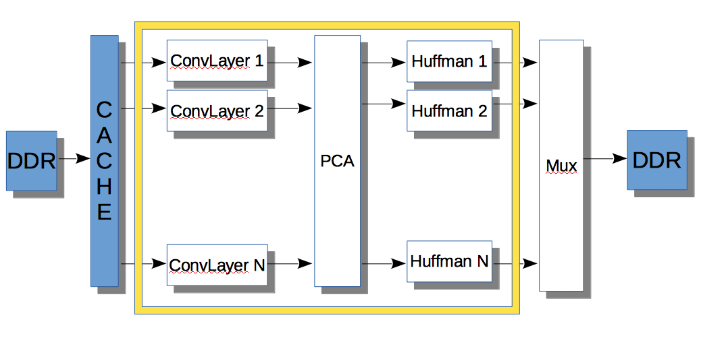
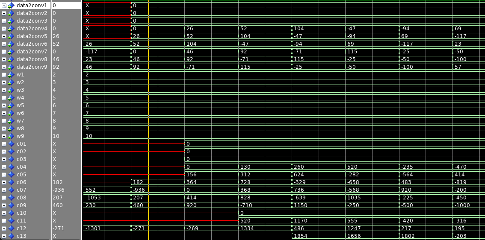
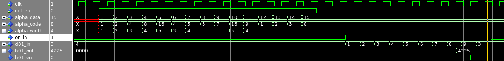

## FPGA Implementation

This folder contains the FPGA VHDL code used to test the resource needed to implement the PCA 

compression algorithm.

# Folder Structure

Each folder contains the complete project that was created in Quartus Prime Pro version 17.1.

# Block Diagram

Each convolution layer was created seperatly. Each layer has it's own project folder, and the resource 
that were used. As mentioned the main article, the 512 convolution layer was interpolated from the 256 layer.
There isn't enough DSPs in the device, so the calculation of this layer was done in 2 steps.

The block diagram for the 64 concolution layer: 

We have implemented the part that is inside the yellow frame. The goal is to verify the PCA 
algorithm, so we only care about the amount of data that will be read and written to the DDR. 

# Simulation Results

Some snapshots of simulation results. More tesbenches are in the code.

Zoom of a basic 'Convolution' unit in a convolution process:\
Data2conv[1:9] – data input. (3 upper values are 0 because it's the first line with zero padding)\
W[1:9] – weights\
C[01:09] – result of multiplication\
c[10:c12] – 1 stage sum result\
C[13] – final result\

Test of Huffman block initialization and data coding:\
init_en - initialization\
alpha_data – “letter”\
alpha_code – coded “letter”\
alpha_width – width of coded “letter”\
d01_in – data input\
h01_out – several letters, coded to 16 bit word\

