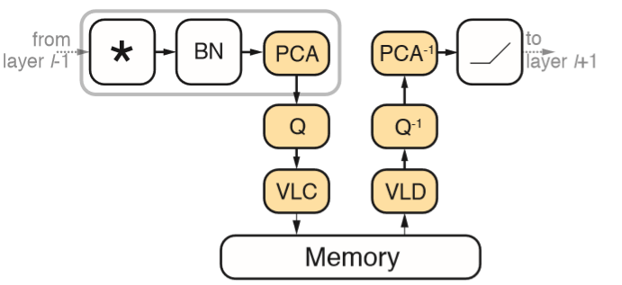
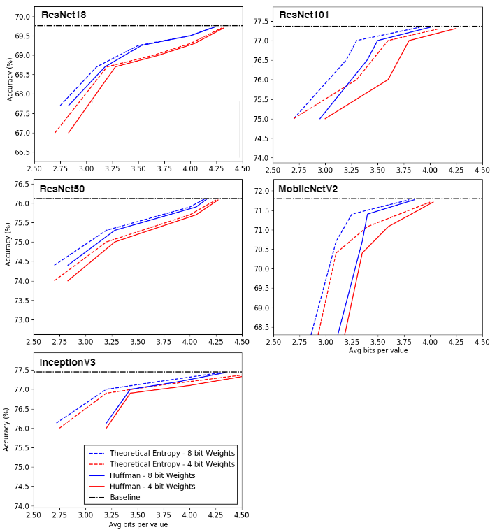

## Feature Map Transform Coding for Energy-Efficient CNN Inference

This code implements the papper "Feature Map Transform Coding for Energy-Efficient CNN Inference"

Arxiv link - TODO

# Flow Diagram

# HW Implementation

TODO

# Datasets  
  
To run this code you need the training (1 batch for calibration) and validation set of ILSVRC2012 data

To get the ILSVRC2012 data, you should register on their [site](http://www.image-net.org/download-imageurls) for access
   

# Running instructions

python main.py --data <ILSVRC2012 folder location> --model <Model name (resnet18 / resnet50 / resnet101 / inception_v3 / mobilenet_v2)>  --actBitwidth <Bits for main principal component> --weightBitwidth <4/8>  --transform --transformType (eye/pca/pcaQ/pcaT)
  
Links to models with quantized weights can be download from:
https://www.mediafire.com/file/ajna79opjt53c12/qmodels.tar/file

unzip the file and put in folder ./qmodels/

 # Results
 
  
# Acknowledgments  
TODO

# Citation  
TODO  
